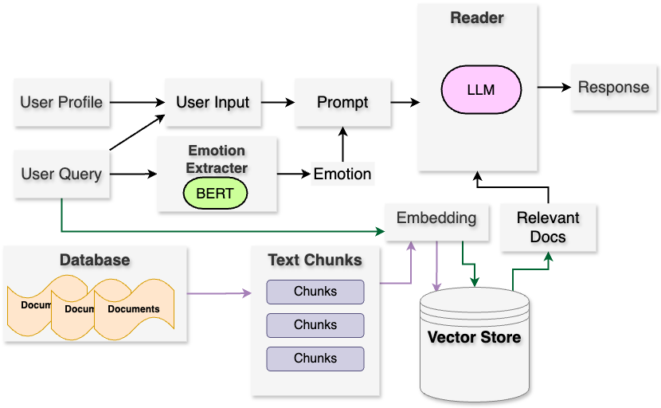

# MindWellChat
## Project Info
**Title**: MindWellChat: Utilizing the RAG-based LLM for mental-health support

**Mentor**: Dr. Vivien P.S. Chan 

**Student 1 (Leader)**	Li Xiaolong(xia01ong@connect.hku.hk)  
**Student 2**	Dai Zhihua   (dzh8888@connect.hku.hk)  
**Student 3**	Shi Beiyu  (sby23hk@connect.hku.hk)  
**Student 4**	Xie Binghong  (u3619927@connect.hku.hk)  
**Student 5**	Lai Mingchao  (u3619882@connect.hku.hk)  
<!-- [Project Github](./another-page.html). -->

## Project Description
The objective of this project is to develop a web platform hosting a chatbot that offers users comprehensive mental health support. We create a relaxed and open conversational environment for users to share experiences and feelings. By integrating psychological counseling, assessment and diagnosis, we aim to establish a close relationship of trust and understanding with users. Leveraging technological advantages, we can understand users' personality, personal experiences, and emotional states, offering a private, warm, secure, timely, and empathetic conversational space. As a mental health support chatbot, our platform provides emotional support and psychological guidance through conversations with users from the perspective of a professional counselor.

## Project structure

## Update

1.  2023-Feb-05: The project is initiated. The team has been formed and the project plan has been drafted. The team has started to work on the project.
1. 2023-Mar-05: First meeting with the mentor. The team has discussed the project plan and the mentor has given some suggestions. The team finalized the project plan as building a web platform hosting a chatbot that offers users comprehensive mental health support. 
1. 2023-Mar-13: The team has finished the detailed proposal and submit to Moodle.

[Link to another page](./another-page).