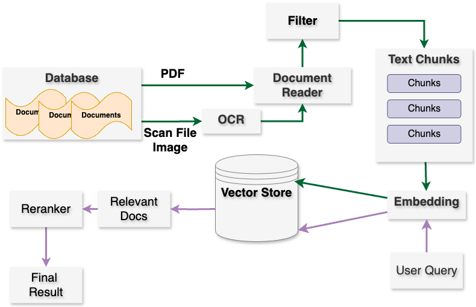

# Project Progress Updates I
[Back to the Home Page](./index)

## Update Overview

During this update phase, we've achieved the following milestones:

### 1. Technology Stack Familiarization
We've gained proficiency in our selected technology stack, including PyTorch, Hugging Face, Langchain,  ChromaDB, and the Large Language Model(LLM)-ChatGLM, through curated tutorials/documents:
- [PyTorch 60-Minute Blitz](https://pytorch.org/tutorials/beginner/deep_learning_60min_blitz.html)
- [Hugging Face NLP Course](https://huggingface.co/learn/nlp-course/chapter1/1)
- [Langchain QA Usage](https://python.langchain.com/docs/use_cases/question_answering/)
- [ChromaDB Usage](https://docs.trychroma.com/getting-started)
- [ChatGLM Usage](https://github.com/THUDM/ChatGLM3?tab=readme-ov-file)

### 2. Dataset Collection and Exploratory Data Analysis (EDA)
We've curated three primary datasets for our project:
- **Mental Health Knowledge Database**: Curated from relevant textbooks, articles, and research papers.
- **Mental Health Q&A Conversations**: Dialogues between professionals and patients in English and Chinese.
- **Emotion Detection Dataset**: User-generated text data annotated with emotion labels.

### 3. Vector Store Construction
Leveraging Langchain, ChromaDB, OpenAI embeddings, we've established a vector store. This pivotal component contains mental health support knowledge and facilitates information retrieval based on user queries.

## Dataset
> The detailed description of each dataset and some EDA can be find in the following [page](./update1_dataset).

### Mental Health Knowledge Database

The Mental Health Knowledge Database is an aggregation of textbooks, articles, and research papers focused on mental health support. Acquired from diverse sources, including academic databases, online libraries, and scholarly publications, this dataset encompasses a broad spectrum of topics within mental health support, such as mental health nursing, clinical psychology, and mental health education. This database serves as the foundation for constructing the vector store, a critical component facilitating information retrieval in our project.

### Mental Health Q&A Conversation Dataset

The Mental Health Q&A Conversation Dataset comprises dialogues between mental health professionals and patients in both English and Chinese. Given the time-intensive and costly nature of data collection, the majority of this dataset is sourced from previous similar projects. It encompasses conversations on diverse topics pertinent to mental health support, including depression, anxiety, and stress. This dataset is instrumental in fine-tuning the LLM to adeptly handle multi-turn conversations—a crucial capability in our project's generative process.

### Emotion Detection Dataset

The Emotion Detection Dataset comprises user-generated text data annotated with emotion labels. Sourced primarily from the Kaggle platform through various competitions or dataset collections, it includes text data labeled with emotions like happy, sad, angry, and neutral. This dataset is utilized to train the emotion detection model, enabling the LLM to gain a nuanced understanding of the user's emotional state throughout conversations.

## Vector Store Construction
>Test cases for the vector store are elaborated in the following [page](./update1_testcases).

In this project, the vector store is constructed leveraging the Mental Health Knowledge Database as its foundational dataset. Initially, we employed the embedding model provided by the Sentence Transformer framework. However, the embeddings produced by the small size model did not meet our performance expectations for retrieving the most contextually relevant information compared to user queries from the vector store and large model increase the burden of computation resources and disk usage.

To enhance the vector store's performance, two potential strategies were considered:

1. Fine-tuning the Sentence Transformer model using our dataset.
2. Utilizing embeddings from the Language Model (LLM) provided by OpenAI to construct the vector store.

We opted for the second approach due to several reasons. Firstly, fine-tuning the model on our dataset would necessitate manually pairing semantically similar sentences, which is both time-intensive and not the primary focus of this project. Furthermore, the efficacy of this approach is not guaranteed to surpass that of the LLM embeddings.

Conversely, OpenAI's embedding models are pre-trained on extensive text corpora, making them adept at capturing nuanced semantic meanings of sentences. These models support multiple languages, enabling us to utilize a single model for both our English and Chinese datasets, thereby eliminating the need to build separate embedding models. Additionally, the cost-effectiveness of this approach is noteworthy; the 'text-embedding-3-small' model incurs a minimal cost of 0.02 USD per million tokens while achieving a performance of 62.3% on the MTEB evaluation (Muennighoff et al., 2022).

In our study, to facilitate multilingual support encompassing both English and Chinese, we employed Chroma to establish distinct collections tailored for each linguistic domain. Leveraging the OpenAI embedding model, we constructed a vector store for each collection, utilizing cosine similarity as the evaluative metric. Subsequently, this vectorized representation facilitates the retrieval of contextually pertinent information from the Mental Health Knowledge Database in response to user inquiries. Within the retrieval mechanism, users possess the autonomy to specify parameters such as the desired number of returned results, query language preference, and the targeted database subsets for interrogation. The vector store, predicated on the user query, adeptly furnishes the most salient information.

Employing an embedding vector database provides a streamlined and effective methodology for retrieving information from the Mental Health Knowledge Database. The resulting vectors manifest a significant degree of semantic alignment with the user's query. However, it is imperative to recognize that semantic congruency does not always translate to optimal relevance in the retrieved content. Additionally, the act of projecting the corpus into finite dimensions can introduce information loss, which can further impact the quality of retrievals. To address these inherent challenges, we have integrated a reranking mechanism within the post-processing stage. As highlighted by Yunfan et al. (2023), a reranker operates in a dual capacity, serving to both optimize and refine the outcomes of information retrieval. We have leveraged the 'BAAI/bge-reranker-base' model (Shitao et al., 2023), an open-source offering from Hugging Face, for this task. This reranking model is meticulously trained to assign a scoring metric to each query-information pair, enabling a more refined prioritization of information based on the computed scores. To augment the accuracy of the retrieved data, we have instituted a threshold scoring criterion, presently established at 0.5. It is worth noting that the optimal value for this threshold might require adjustments based on the overall performance and efficacy of the application.

#### Reference(APA style)
Muennighoff, N., Tazi, N., Magne, L., & Reimers, N. (2022). MTEB: Massive Text Embedding Benchmark. ArXiv, abs/2210.07316.

Shitao Xiao, Zheng Liu, Peitian Zhang, & Niklas Muennighoff. (2023). C-Pack: Packaged Resources To Advance General Chinese Embedding. ArXiv, abs/2309.07597.

Gao, Y., Xiong, Y., Gao, X., Jia, K., Pan, J., Bi, Y., Dai, Y., Sun, J., Guo, Q., Wang, M., & Wang, H. (2023). Retrieval-Augmented Generation for Large Language Models: A Survey. ArXiv, abs/2312.10997.