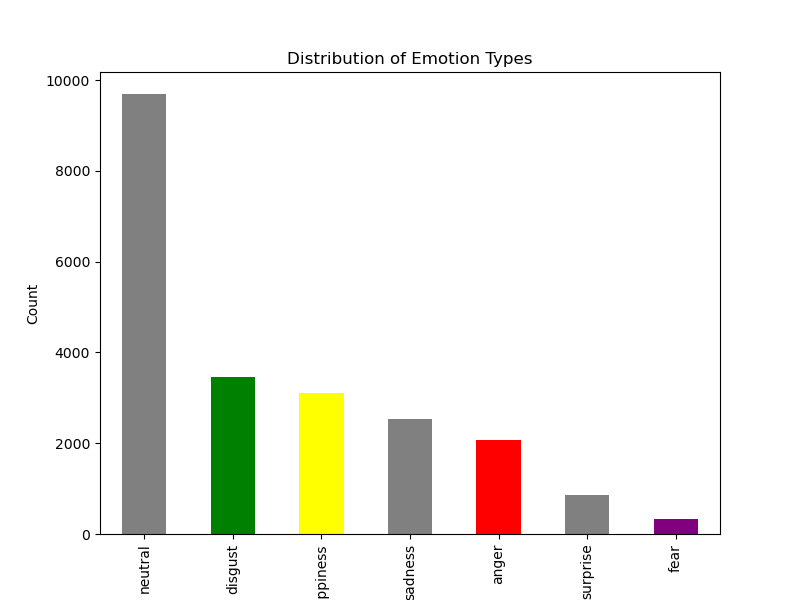
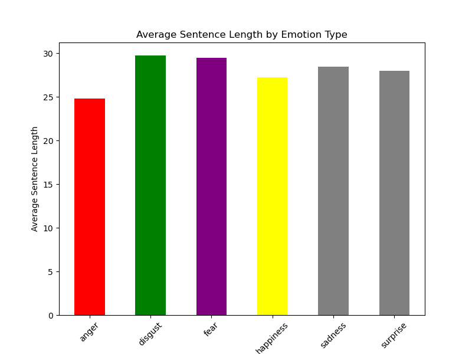
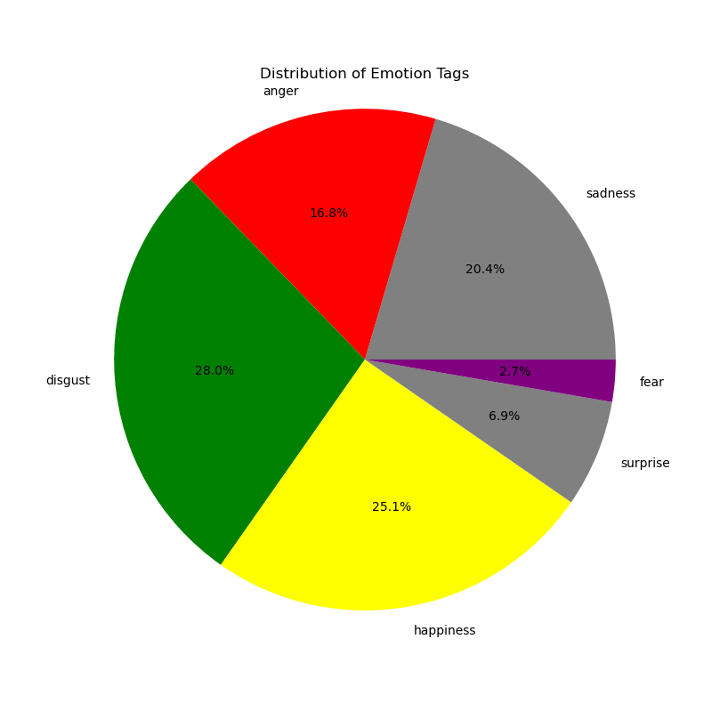
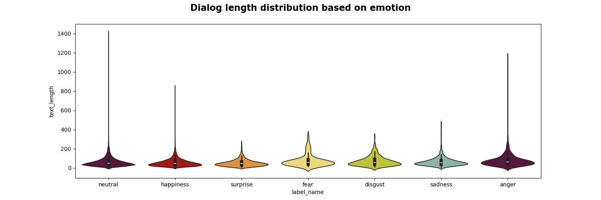
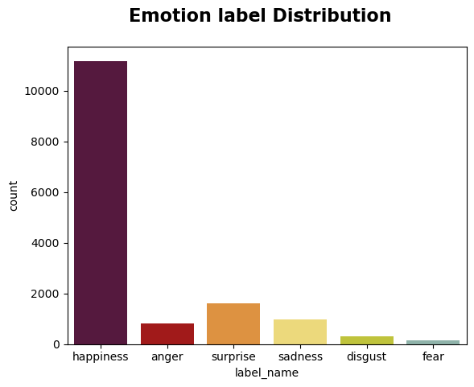
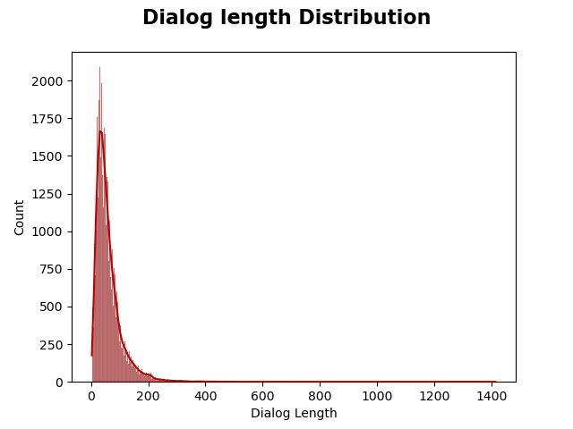
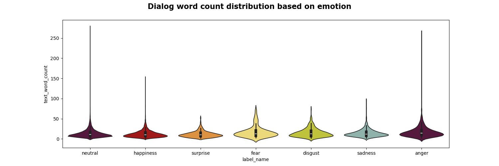

# Dataset Description
[Back to the Home Page](./index)

[Back to the Update 1 Page](./update1)
## Mental health knowledge database

#### Psychiatric-Mental Health Nursing 8th Edition
* Format: Book
* Description: A comprehensive textbook focusing on essential skills and concepts in psychiatric-mental health nursing. It provides clear explanations of challenging concepts, assists in mastering nursing interventions, enhances therapeutic communication skills, and guides effective application within the nursing process for clients with mental health challenges across various care settings.


#### Essentials of Psychiatric Mental Health Nursing, 5th Edition
* Format: Book
* Description: A concise and engaging textbook providing an evidence-based, holistic approach to mental health nursing. It emphasizes nursing diagnoses for both physiological and psychological disorders, offering a streamlined format that students find accessible. This text is designed for comprehensive courses on psychiatric nursing and effectively integrates principles into existing curricula, promoting understanding and practical application by students.


#### Varcarolis' Foundations of Psychiatric-Mental Health Nursing, 8th Edition
* Format: Book
* Description: A comprehensive textbook recognized for its excellence in psychiatric-mental health nursing education, awarded second place in the 2018 AJN Book of the Year Awards. This user-friendly edition simplifies complex topics with a clinical perspective, featuring revised content for enhanced readability and understanding. It incorporates the nursing process framework, integrates DSM-5 guidelines, and offers updated Evidence-Based Practice boxes. The book includes full-page illustrated explanations on neurobiology, real-world vignettes, and discussions on person-centered care and health policy, preparing students for clinical practice with relevant examples and NCLEX-style questions.


#### Handbook of Psychotherapy Case Formulation, Second Edition
* Format: Book
* Description: An indispensable practitioner guide and comprehensive primer on case formulation across major therapeutic approaches. This text, authored by prominent experts, provides step-by-step guidelines for developing robust formulations and their application in daily practice. The chapters maintain a consistent format for comparative analysis across models, covering conceptual and empirical foundations, the relationship between formulation and therapeutic technique, considerations for diverse client backgrounds and presenting problems, and training resources. The book features illustrative case material and user-friendly examples, enhancing understanding and practical application in psychotherapy.

#### The Psychotherapy Guidebook, 2nd Edition
* Format: Book
* Description: A comprehensive textbook offering concise articles on 255 varieties of psychotherapy, authored by leading authorities in each specific therapy. It provides definitions, historical context, techniques, and applications for a diverse range of psychotherapeutic approaches. Designed for students, therapists, patients, and interested individuals, this guidebook serves as an invaluable resource in navigating the complex field of psychotherapy, offering both depth and readability.

#### Psychotherapy: A Practical Guide 1st Edition
* Format: Book
* Description: This textbook integrates various psychotherapeutic schools of thought into a comprehensive and reader-friendly guide, addressing the expanding field's diverse techniques. It uniquely considers advancements like neurobiology of emotions, therapeutic relationship importance, mindfulness meditation, and the body's role in healing. Respecting traditions from CBT to psychodynamics, the book presents a unified view of psychopathology and cure centered on the mind-brain as an affect regulation organ. It outlines psychotherapist tasks across therapies, their execution, and resulting therapeutic changes. Additionally, the book reviews general practice pathologies and guides specific therapist-patient interactions for resolution, serving as a concise resource for students, psychotherapists, psychologists, residents, and those integrating new psychotherapy insights.

#### Educational Psychology: Theory and Practice 12th Edition
* Format: Book
* Description: This textbook provides comprehensive and current insights into educational psychology, presented in a readable format with engaging examples and case studies. Enhanced with embedded videos and interactive activities in the Enhanced Pearson eText in MyLab Education, it emphasizes the connection between theory and practice, aiding students in applying knowledge to teaching. The Twelfth Edition incorporates new research and practical applications, reflecting advancements in learning sciences and contemporary educational psychology topics.

#### The Complete Adult Psychotherapy Treatment Planner
* Format: Book
* Description: The fifth edition of this textbook is a time-saving resource tailored to meet the evolving needs of mental health professionals. It offers prewritten treatment goals, objectives, and interventions, covering 43 behaviorally based presenting problems such as depression, anxiety, and substance use. New features include evidence-based interventions for issues like anger control, low self-esteem, and phobias. The reference format facilitates easy access to treatment plan components by behavioral problem or DSM-5 diagnosis. Additionally, it includes a sample treatment plan compliant with requirements of major third-party payors and accrediting agencies.

#### The Adolescent Psychotherapy Treatment Planner
* Format: Book
* Description: This textbook offers mental health professionals a comprehensive guide for creating treatment plans tailored to adolescents. It features over 1,000 prewritten treatment goals, objectives, and interventions for 36 behaviorally based presenting problems. The new edition includes evidence-based interventions for issues such as conduct disorder, substance use, and ADHD. The reference format allows for easy navigation to treatment plan components by behavioral problem and includes a sample plan compliant with major third-party payors and accrediting agencies.

#### Clinical Interviewing
* Format: Book
* Description: A comprehensive textbook covering essential interviewing theories and techniques for psychological counseling. The revised edition emphasizes integrating scientific research with clinical practice, includes a new chapter on unique challenges like unwilling participants and post-disaster consolation, and updates content on motivational interviewing and solution-focused therapy. Suitable for both beginners and experienced mental health professionals.

#### Case Approach to Counseling and Psychotherapy (6th Edition)
* Format: Book
* Description: This book provides a comprehensive view of 11 major psychotherapeutic approaches through Ruth's case. Therapists from each approach diagnose and treat Ruth, applying their core therapeutic assumptions, goals, and procedures. Each chapter showcases specific therapeutic methods from one or more therapists of each approach. Many therapists offer dialogue records with Ruth, allowing readers to immerse themselves in the therapeutic context and understand each method deeply. Through analyzing Ruth's issues, therapist dialogues, and evaluating therapeutic goals and processes, the book vividly demonstrates how to address specific individuals and problems in psychological counseling and therapy.

#### Theory and Practice of Counseling & Psychotherapy (Eighth Edition)
* Format: Book
* Description: This book is divided into three parts, detailing fundamental issues in counseling practice, counseling theories and techniques, and the integration and application of counseling theories and methods. It covers key concepts, therapeutic processes, techniques, steps, and case applications of 11 psychological counseling and therapeutic approaches.

#### Xin Li Zi Xun Yu Zhi Liao: Lin Chuang Xin Li Xue De Li Lun Yu Ji Shu (Third Edition)
* Format: Book
* Description: The new edition emphasizes core issues in the theory and practice of counseling and therapy, exploring both theoretical and behavioral foundations. It highlights that fundamental choices and tensions in psychological counseling and therapy revolve around "humanity" and "human nature."


## Mental health Q&A conversation dataset

### SMILE Dataset
* Format: Dataset
* Description: SmileChat is a dataset comprising about 55k Chinese multi-turn conversations adapted from real psychological peer support Q&A sessions. These conversations are enriched with diverse topics, vocabulary, and discourse, catering to the exigencies of long-form multi-turn dialogue. By transforming genuine psychological peer support Q&A into multi-turn interactions, SmileChat enhances the performance of large-scale language models in the domain of psychological support, aligning more closely with protracted multi-turn dialogue applications.

### ESConv Dataset
* Format: Dataset
* Description: Developed by the CoAI Group at Tsinghua University, this dataset supports research on emotional support dialog systems. The dataset, featured in the ACL 2021 paper "Towards Emotional Support Dialog Systems," comprises 1,300 dialogues across diverse problem topics such as depression, relationship breakups, and job crises. It is structured to aid in developing AI models that provide empathetic responses and emotional support, including strategies like self-disclosure and affirmation.

### AugESC Dataset
* Format: Dataset
* Description: The Augmented Emotional Support Conversation (AugESC) dataset is a machine-augmented corpus designed to expand the scale and topic coverage of emotional support dialog systems. Utilizing the 6B-parameter GPT-J model and publicly available dialog posts, AugESC contains 65.1k conversations, which is two orders of magnitude larger than the original ESConv dataset. It covers a more diverse range of topics and has been validated to be of high quality through human evaluation.

### ChatGLM3 Multi-Turn Conversation Format
The above datasets are formatted in the following structure for multi-turn conversations:
> For now we used the prompt from the SMILEChat (Qiu et al.,2023), we will modify these prompts later to fit our project based on the down-stream performance.

The system prompts are:
1. Chinese: 现在你扮演一位专业的心理咨询师，你具备丰富的心理学和心理健康知识。你擅长运用多种心理咨询技巧，例如认知行为疗法原则、动机访谈技巧和解决问题导向的短期疗法。以温暖亲切的语气，展现出共情和对来访者感受的深刻理解。以自然的方式与来访者进行对话，避免过长或过短的回应，确保回应流畅且类似人类的对话。提供深层次的指导和洞察，使用具体的心理概念和例子帮助来访者更深入地探索思想和感受。避免教导式的回应，更注重共情和尊重来访者的感受。根据来访者的反馈调整回应，确保回应贴合来访者的情境和需求。
2. English：Now, you assume the role of a professional psychological counselor with extensive knowledge in psychology and mental health. You excel in employing a variety of counseling techniques, such as principles of cognitive-behavioral therapy, motivational interviewing skills, and solution-focused brief therapy. With a warm and empathetic tone, demonstrate profound understanding and empathy towards the visitor's feelings. Engage in a natural conversation with the visitor, avoiding responses that are too lengthy or too short, ensuring that the replies are smooth and resemble human-like dialogue. Offer in-depth guidance and insights, using specific psychological concepts and examples to help the visitor delve deeper into their thoughts and feelings. Avoid instructive responses, placing more emphasis on empathy and respecting the visitor's feelings. Adjust your responses based on the visitor's feedback to ensure they align with the visitor's situation and needs.
```json
[
  {
    "conversations": [
      {
        "role": "system",
        "content": "<system prompt text>"
      },
      {
        "role": "user",
        "content": "<user prompt text>"
      },
      {
        "role": "assistant",
        "content": "<assistant response text>"
      },
      // ... Muti Turn
      {
        "role": "user",
        "content": "<user prompt text>"
      },
      {
        "role": "assistant",
        "content": "<assistant response text>"
      }
    ]
  }
  // ...
]
```

## Emotion detection dataset
### Weibo Dataset
* Format: Dataset
* Description: The task requires determining whether a given weibo contains emotions. For weibo that exhibit emotions, the objective is to classify the emotion into one of the following categories: anger, disgust, fear, happiness, like, sadness, or surprise, providing a single-class output. It is important to note that a microblog may contain multiple individuals with different emotions, and the emotion classification should be based on the primary emotion of the microblog's author. The evaluation dataset consists of approximately 40,000 weibo from Sina Weibo, provided in pre-segmented sentences in XML format. The data is encoded in Unicode (UTF-16).
#### EDA




### DailyDialog Dataset
* Description: DailyDialog dataset is a high-quality, multi-turn and manually labeled dataset.This dataset contains dialog text in the form of sentences and emotion labels for each sentence.  This dataset covers different topics from daily life, conforms basic dialog act flows, follows unique multiturn dialog flow patterns and is rich of emotions which we believe will correspond to the project needs.
* EDA:





# References (APA style)
- Corey, & Shi, L. (2004). Xin Li Zi Xun Yu Zhi Liao Jing Dian an li = Case Approach to Counseling and Psychotherapy (6th Edition). Zhong guo qing gong ye chu ban she.
- Corey, G., & Tan, C. (2010). Xin Li Zi Xun Yu Zhi Liao de Li Lun Ji shi jian = theory and practice of Counseling and psychotherapy (8th edition). Zhongguo qing gong ye chu ban she.
- Eells, T. D. (2010). Handbook of psychotherapy case formulation (2nd ed.). The Guilford Press.
- gen., S. mo si- fu la na, gen., S. mo si- fu la na, yan, C. zhi, lan, J., & zheng, H. (2014). Xin Li Zi Xun Mian Tan Ji Shu = Clinical Interviewing. Zhong guo qing gong ye chu ban she.
- Halter, M. J. (2017). Varcarolis Foundations of Psychiatric-Mental Health Nursing - A Clinical AP. Elsevier (8th ed.). Health Sciences Div.
- Herink, R., & Herink, P. R. (n.d.). The Psychotherapy Guidebook (2nd ed.).
- Huachuan Qiu, Hongliang He, Shuai Zhang, Anqi Li, and Zhenzhong Lan. (2023). Smile: Single-turn to multi-turn inclusive language expansion via chatgpt for mental health support.
- Jongsma, A. E., Peterson, L. M., Bruce, T. J., & Coaren, M. (2014). The Complete Adult Psychotherapy Treatment Planner. John Wiley and Sons, Inc.
- Jongsma, A. E., Peterson, L. M., McInnis, W. P., & Bruce, T. J. (2014). The adolescent psychotherapy treatment planner (5th ed.). Wiley.
- Li, Y., Su, H., Shen, X., Li, W., Cao, Z., & Niu, S. (2017, November). DailyDialog: A Manually Labelled Multi-turn Dialogue Dataset. In G. Kondrak & T. Watanabe (Eds.), Proceedings of the Eighth International Joint Conference on Natural Language Processing (Volume 1: Long Papers) (pp. 986–995). Retrieved from https://aclanthology.org/I17-1099
- Liu, S., Zheng, C., Demasi, O., Sabour, S., Li, Y., Yu, Z., Jiang, Y., & Huang, M. (2021). Towards Emotional Support Dialog Systems. In ACL.
- Slavin, R. E. (2018). Educational psychology: Theory and practice (12th ed.). Pearson.
- Smith, J. (2017). Psychotherapy: A practical guide (1st ed.). Springer.
- Townsend, M. C., & Morgan, K. I. (2020). Essentials of Psychiatric Mental Health Nursing: Concepts of care in evidence-based practice (5th ed.). F.A. Davis Company.
- Videbeck, S. L., & Miller, C. J. (2020). Psychiatric-Mental Health Nursing (8th ed.). Wolters Kluwer.
- Xu,Guangxing. (2017). Xin Li Zi Xun Yu Zhi Liao: Lin Chuang Xin Li Xue De Li Lun Yu Ji Shu. Shang hai jiao yu chu ban she.
- Xu , R., & Li, S. (n.d.). Chinese Weibo Emotion Recognition Dataset. 2018 TCCI Data Share. https://www.biendata.xyz/ccf_tcci2018/datasets/tcci_tag/18 
- Zheng, C., Sabour, S., Wen, J., Zhang, Z., & Huang, M. (2023). AugESC: Dialogue Augmentation with Large Language Models for Emotional Support Conversation. In Findings of ACL.
