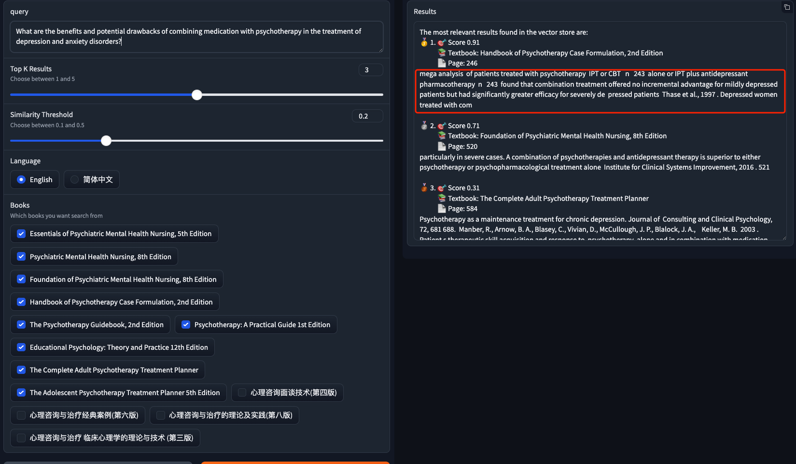
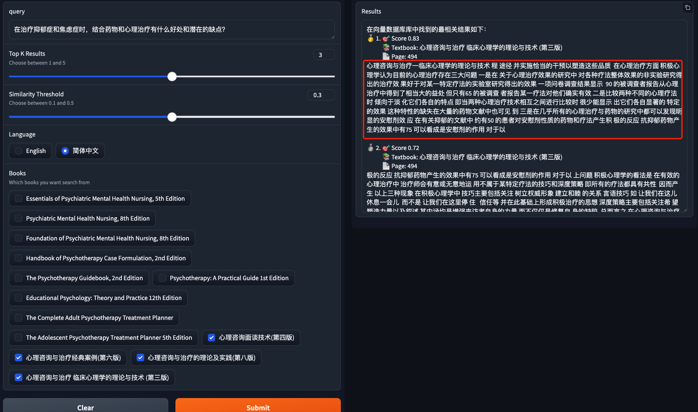

# Vector Store Test Cases
[Back to the Home Page](./index)

[Back to the Update 1 Page](./update1)

**The following questions are generated by Chat-GPT 3.5**

>How do childhood experiences influence adult mental health outcomes, and what therapeutic approaches are effective in addressing early-life trauma?

> What are the benefits and potential drawbacks of combining medication with psychotherapy in the treatment of depression and anxiety disorders?

> 在治疗抑郁症和焦虑症时，结合药物和心理治疗有什么好处和潜在的缺点？

