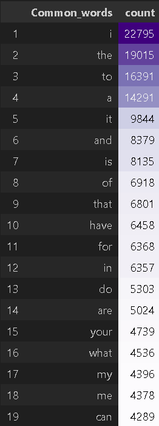
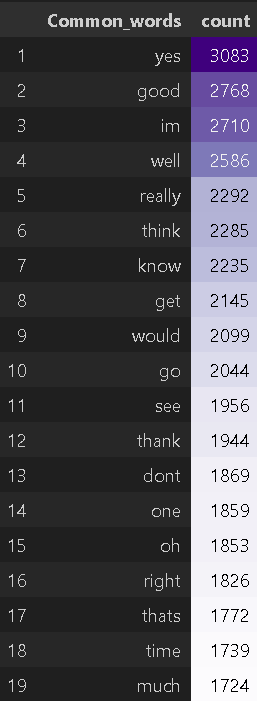
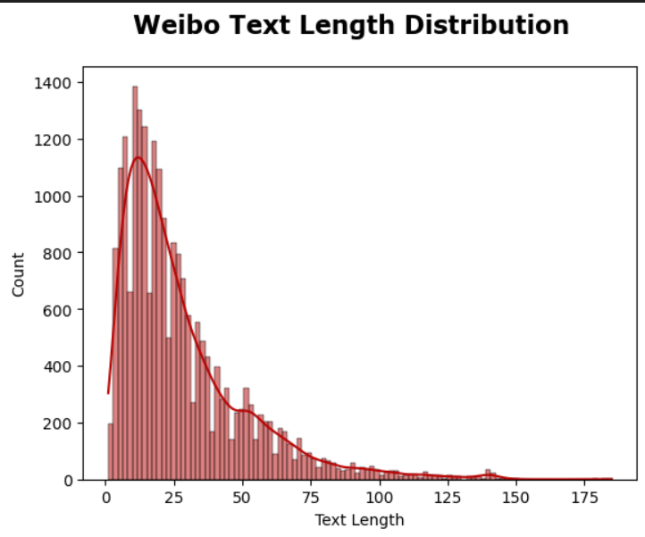
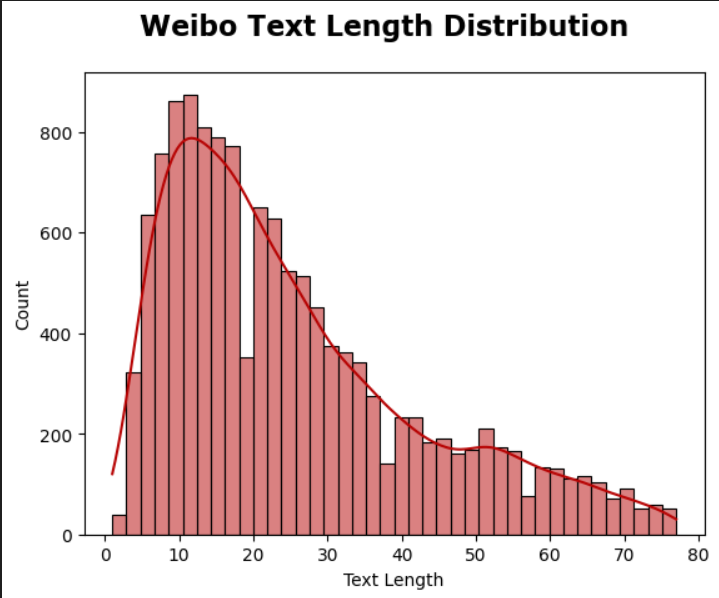

First, we have an errata, our previous emotion dataset only had 6 emotions, now we have added neutral emotion for better analysis

**1.Clean Corpus**

In this initial step, we focused on preparing the dataset for analysis by cleaning the corpus. This included removing unwanted characters, correcting encoding issues, and standardizing text formatting to ensure consistency across the data.

**2.Remove Stopwords in English**

We utilized the nltk library to identify and remove stopwords from the English text within our dataset. This step is crucial as it eliminates commonly used words that do not contribute significantly to the sentiment of the text, thereby reducing noise in the dataset.

Common words change in English:

|

**3.Remove Duplicate Rows**

To ensure the uniqueness of our dataset, we performed deduplication by removing identical rows. This prevents the model from being biased towards repeated samples during training.

**4.Remove the Outlier Based on the Text Length**   

Although the code specifics were not provided up to step 3, typically, this step would involve analyzing the distribution of text lengths and removing entries that are too long or too short, which could be considered outliers. This is done to avoid training the model on noise and to ensure that the data is representative of typical text lengths.

Images below show the text length changes:

|
|

**5.Remove Too Short Sentences in Both Datasets**

This step involves filtering out sentences that are below a certain length threshold. Short sentences often lack sufficient context for accurate sentiment analysis and can negatively impact the model's performance.

**6.Resampling the Dataset to Get Balanced Distribution**

We found that the f1 of the Chinese and English models is very low, especially in English. After some research, we found that the label distribution of the original data set was too unbalanced.We have planned for two sub-steps under this process:

  * **Upsampling in Chinese:** Increasing the representation of underrepresented classes in the Chinese dataset to balance the class distribution.
  
  * **Downsampling and Upsampling in English:** Adjusting the English dataset by decreasing the representation of overrepresented classes and increasing the representation of underrepresented ones.

**7.Convert to HF Dataset & Split to Train-Dev-Test Set**

Here, we will be converting our cleaned dataset into a format compatible with Hugging Face's datasets library and splitting it into training, development, and testing sets. This ensures that we have separate data for model training, hyperparameter tuning, and final evaluation.

**8.Tokenize**   

We will convert the text into a format that can be fed into a model for training. We will use tokenizers compatible with our models, ensuring that the inputs are correctly formatted.
